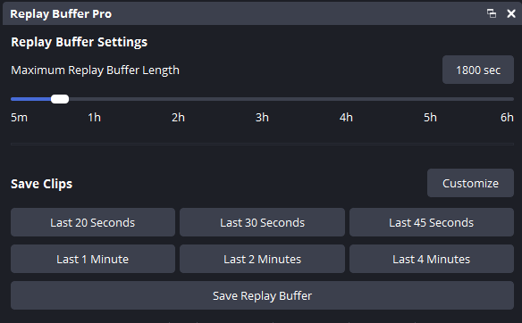
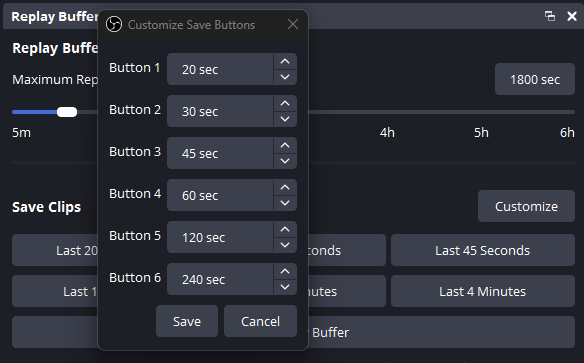

# Replay Buffer Pro

[
](https://github.com/JoshuaPotter/replay-buffer-pro/releases/latest/download/replay-buffer-pro-windows-x64.zip)

This OBS Studio plugin expands upon the built-in Replay Buffer, allowing users to save recent footage at different lengths with customizable save buttons, similar to how PlayStation/Xbox's "Save Recent Gameplay" functionality.

**Note:** Windows builds are 64-bit only, as OBS Studio 29.0.0+ dropped 32-bit support. macOS builds are universal binaries (arm64 + x86_64). Linux builds are shared objects (`.so`) installed to the system OBS plugin path.

## How It Works
OBS keeps a rolling buffer of the last few seconds or minutes of footage in memory using the built-in replay buffer. The length of this footage is defined in settings. If the amount of footage exceeds the length in settings, old footage is overwritten as new footage is recorded.

Unlike the default Replay Buffer, which saves a fixed duration, this OBS Studio plugin allows users to save different lengths on demand. Set the replay buffer length, then clip custom lengths of footage automatically. Example: Set your replay buffer to 10 minutes. Save the last 30 seconds, 2 minutes, or 5 minutes instantly with UI buttons or hotkeys.

The project website is currently hosted via GitHub Pages.



## Usage

### Saving Clips
1. Start the Replay Buffer in OBS
2. Click any save clip button (customizable durations) or use the assigned hotkey
3. Use the Customize button to set your preferred clip lengths

   

4. The plugin will:
   - Save the full replay buffer
   - Automatically trim to the selected duration (Without re-encoding)
   - Replace the original file with the trimmed version

### Buffer Length
- Quickly adjust built-in replay buffer length (1s to 6h) without digging through the settings

### Hotkeys
- Assign hotkeys to each save duration button in OBS Settings > Hotkeys

## Installation

### From Release

1. Download latest release
2. Extract and merge the folder `obs-studio` with your OBS Studio installation

Final file structure should look like this:
```
obs-studio/
├── obs-plugins/
│   └── 64bit/
│       └── replay-buffer-pro.dll
└── data/
    └── obs-plugins/
        └── replay-buffer-pro/
            └── locale/
                └── en-US.ini
```

### From Source 

See below for instructions to build from source.

After building, use `cmake --install` to automatically install the plugin, or manually copy the compiled files:
1. Copy compiled plugin:
   - Windows: `replay-buffer-pro.dll` to your OBS plugins directory
   - macOS: `replay-buffer-pro.plugin` bundle to your OBS plugins directory  
   - Linux: `replay-buffer-pro.so` to your OBS plugins directory
2. Copy from source `data` directory:
   - Data files to your OBS data path for the plugin

Note: Close OBS before installing or copying the plugin files.

## Building from Source

The build system follows the [obs-plugintemplate](https://github.com/obsproject/obs-plugintemplate) pattern. On **Windows and macOS**, all dependencies (OBS Studio source, prebuilt obs-deps, Qt6) are **automatically downloaded** at configure time. On **Linux**, dependencies come from system packages via apt.

### Requirements

**Windows:**
- Windows 10/11 64-bit
- Visual Studio 2022+ with "Desktop development with C++"
- CMake 3.28+

**macOS:**
- macOS 12.0+ (builds target macOS 12.0+; universal binary: arm64 + x86_64)
- Xcode 16+ with macOS SDK 15.0+
- CMake 3.28+

**Linux (Ubuntu):**
- Ubuntu 22.04+ or compatible distro
- GCC or Clang compiler
- CMake 3.28+
- Ninja build system
- System packages: OBS Studio, Qt6, FFmpeg (via apt — see Build section below)

No manual OBS clone, Qt6 install, or FFmpeg setup is needed on Windows or macOS — everything is fetched automatically. On Linux, system packages are used.

### Build (Windows)

```bash
git clone https://github.com/joshuapotter/replay-buffer-pro.git
cd replay-buffer-pro

# Configure (first run downloads deps and builds OBS — takes a few minutes)
cmake --preset windows-x64

# Build the plugin
cmake --build --preset windows-x64

# Install (close OBS first)
cmake --install build_x64 --config RelWithDebInfo
```

The install target places the plugin in `%ALLUSERSPROFILE%/obs-studio/plugins/`. After building, a rundir is also available at `build_x64/rundir/RelWithDebInfo/` for quick testing.

### Build (macOS)

```bash
git clone https://github.com/joshuapotter/replay-buffer-pro.git
cd replay-buffer-pro

# Configure (first run downloads deps and builds OBS — takes a few minutes)
cmake --preset macos

# Build the plugin (universal binary)
cmake --build --preset macos

# Install (close OBS first)
cmake --install build_macos --config RelWithDebInfo
```

The install target places the `.plugin` bundle in `~/Library/Application Support/obs-studio/plugins/`. After building, a rundir is also available at `build_macos/rundir/RelWithDebInfo/` for quick testing.

### Build (Linux / Ubuntu)

```bash
git clone https://github.com/joshuapotter/replay-buffer-pro.git
cd replay-buffer-pro

# Install system dependencies (requires OBS PPA)
sudo add-apt-repository ppa:obsproject/obs-studio
sudo apt update
sudo apt install build-essential cmake ninja-build pkg-config ccache \
  libavformat-dev libavcodec-dev libavutil-dev \
  obs-studio qt6-base-dev qt6-base-private-dev libqt6svg6-dev \
  libgles2-mesa-dev libsimde-dev

# Configure
cmake --preset ubuntu-x86_64

# Build the plugin
cmake --build --preset ubuntu-x86_64

# Install (close OBS first)
cmake --install build_x86_64 --prefix /usr --config RelWithDebInfo
```

The install target places the plugin in `/usr/lib/x86_64-linux-gnu/obs-plugins/` and data files in `/usr/share/obs/obs-plugins/replay-buffer-pro/`. After building, a rundir is also available at `build_x86_64/rundir/RelWithDebInfo/` for quick testing.

### Release (Windows)

Update the version in `buildspec.json`, then run:
```bash
cmake --preset windows-x64
cmake --build build_x64 --config RelWithDebInfo --target prepare_release
```
This creates `build_x64/releases/<version>/replay-buffer-pro-windows-x64.zip`.

### CI / GitHub Actions

Pushing a semver tag (e.g., `1.4.0`) to `main`/`master` triggers the GitHub Actions workflow, which builds the plugin for Windows, macOS, and Ubuntu 24.04 and creates a draft GitHub release with all artifacts attached.

### Project Structure

```
replay-buffer-pro/
├── buildspec.json       # Plugin metadata + dependency versions (Windows + macOS; Linux uses system packages)
├── CMakePresets.json    # Build presets (windows-x64, macos, ubuntu-x86_64)
├── CMakeLists.txt       # Main build configuration
├── cmake/               # CMake modules (common + windows + macos + linux)
├── data/               
│   └── locale/          # Translations
├── src/                 # Source files (fully cross-platform)
│   ├── config/          # Config constants
│   ├── managers/        # Core functionality managers
│   ├── plugin/          # Main plugin implementation
│   ├── ui/              # User interface components
│   └── utils/           # Utility classes (including video-trimmer)
├── .github/             # CI workflows, actions, scripts (Windows, macOS, Linux)
├── docs/                # Project website source
├── reference/           # Developer documentation
└── README.md
```

## Troubleshooting

- Verify plugin file location:
  - Windows: `.dll` in `obs-plugins/64bit/`
  - macOS: `.plugin` bundle in `~/Library/Application Support/obs-studio/plugins/`
  - Linux: `.so` in `/usr/lib/x86_64-linux-gnu/obs-plugins/` (or equivalent for your architecture)
- Check OBS logs for errors
- For trimming issues:
  - Check disk space
  - Check write permissions in output directory
- When building from source:
  - **Windows**: Ensure Visual Studio 2022+ and CMake 3.28+ are installed
  - **macOS**: Ensure Xcode 16+ (with macOS SDK 15.0+) and CMake 3.28+ are installed; run `xcode-select --install` if needed
  - **Linux**: Ensure OBS Studio PPA is added and all system dependencies are installed via apt
  - First configure run downloads ~500MB of dependencies on Windows/macOS — ensure network access
  - **Windows**: Run install command in a terminal with admin privileges if installing to a protected directory

## Third-Party Software

This plugin uses FFmpeg libraries (libavformat) for video trimming functionality. On **Windows and macOS**, FFmpeg comes from OBS Studio's bundled libraries. On **Linux**, FFmpeg is provided by system packages. FFmpeg is licensed under the LGPL v2.1+ license.

## License

GPL v2 or later. See LICENSE file for details. 
